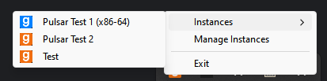
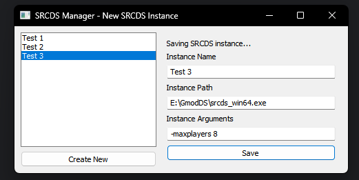

# **SRCDS Manager**
A simple program to manage multiple **SRCDS** instances though the system tray. \
SRCDS Manager should work on all platforms but as only been tested on **Windows**

## Showcase images
 \
